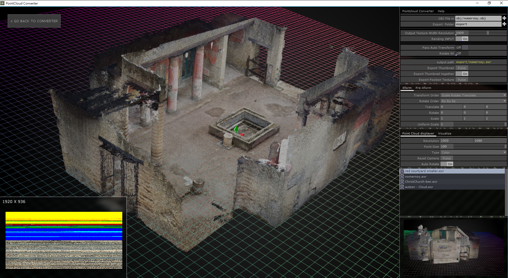

TD-PointCloud-Converter
---
<!--

-->
To use the GPU to process point clouds, convert point cloud assets into location & color texture (.EXR). Created with [TouchDesigner].

> Notes: This project has been submitted to the [Derivative][TouchDesigner] as a reference for the upcoming point cloud function in TD.
I am here to submit based on being asked. I think that the later TD experimental version will have [new operators](https://docs.derivative.ca/Experimental:Point_Cloud_In_TOP "Point Cloud In TOP") to simplify these processes, even built-in features similar to this component(may directly support point cloud format reading and conversion to 32-bit texture), then it is recommended to use TD's built-in methods, but I will still update this component based on the new method(if there is such a value). #2019-07-27

<https://www.youtube.com/watch?v=Z494TsV9WPo>

## How to use
To use this component, you must convert the point cloud source to an `.obj` file (because the current TD version (2019.1xxxx) supports direct use of this file format), you can do it with the free software [MeshLab]. If your point cloud asset is not supported by [MeshLab], you can also use the open source software [CloudCompare] to convert your assets to `.ply` files and then convert them to `.obj` files.
The above relay file (`.ply`, `.obj`) is recommended to use the binary format, especially the relay file before entering this TD component, which can greatly reduce the waiting time for reading.

[TouchDesigner]:https://www.derivative.ca/ "Derivative Page"
[MeshLab]:http://www.meshlab.net/ "MeshLab Page"
[CloudCompare]:http://www.meshlab.net/ "CloudCompare Page"

----------

Author: Yea Chen <yeataro@gmail.com>

License: Attribution-ShareAlike 4.0 International (CC BY-SA 4.0)

